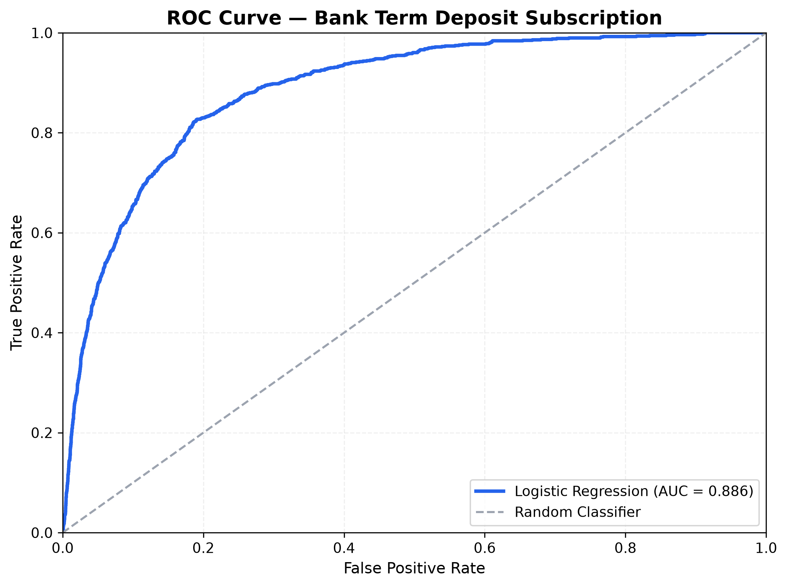
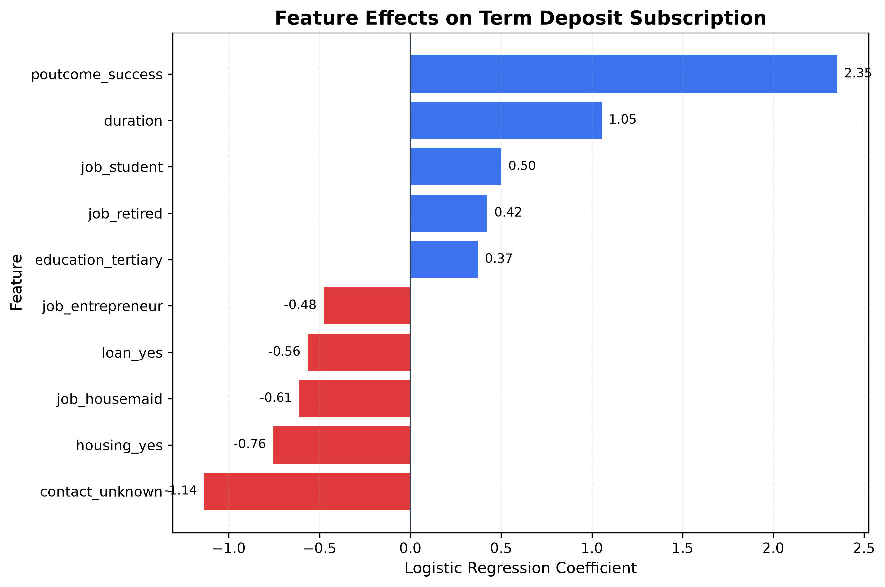

# 🏦 Bank Term Deposit Subscription Prediction

A binary classification project that uses **Logistic Regression** to estimate whether a bank customer is likely to subscribe to a term deposit based on demographic, financial, and marketing campaign information.

## 🎯 Problem

Bank marketing campaigns often require contacting large numbers of customers, while only a small proportion ultimately subscribe to a term deposit.

This project asks:

> **Can customer and campaign characteristics be used to predict whether a client will subscribe to a term deposit?**

The objectives are to:

* Build a binary classification model
* Identify factors associated with subscription probability
* Evaluate model discrimination and classification performance
* Translate model results into practical marketing insights

## 📊 Dataset

**Source:** UCI Machine Learning Repository — Bank Marketing Dataset

The dataset contains **45,211 customer records** from direct marketing campaigns conducted by a Portuguese banking institution. The classification target is whether the customer subscribed to a term deposit (`yes` / `no`).

The project uses `bank_marketing.csv`.

### Main Variables

| Category            | Examples                                             |
| ------------------- | ---------------------------------------------------- |
| Customer profile    | Age, job, marital status, education                  |
| Financial status    | Balance, housing loan, personal loan, credit default |
| Contact information | Contact type                                         |
| Campaign history    | Previous contacts, previous campaign outcome         |
| Current interaction | Contact duration                                     |
| Target              | Term-deposit subscription                            |

## 🔬 Method

The analysis follows a standard binary-classification workflow.

### 1. Data Preparation

* Encode the target variable:

  * `yes` → 1
  * `no` → 0
* One-hot encode categorical variables
* Standardize numerical variables
* Split the data into training and test sets using an **80/20 stratified split**

### 2. Logistic Regression

A Logistic Regression model is fitted to estimate the probability that a customer subscribes to a term deposit.

The model provides both:

* **Classification performance**
* **Interpretable coefficients and odds ratios**

### 3. Model Evaluation

Performance is evaluated using:

* ROC-AUC
* Accuracy
* Precision
* Recall
* Confusion Matrix

## 📈 Results

The Logistic Regression model achieves:

| Metric       |     Result |
| ------------ | ---------: |
| **ROC-AUC**  | **0.8863** |
| **Accuracy** |  **90.0%** |

### Confusion Matrix

|                | Predicted No | Predicted Yes |
| -------------- | -----------: | ------------: |
| **Actual No**  |        7,800 |           185 |
| **Actual Yes** |          729 |           329 |

The model demonstrates strong overall discrimination, but the relatively small number of true positives highlights the importance of looking beyond accuracy when evaluating this imbalanced classification problem.

### Key Predictors

| Feature            | Coefficient | Odds Ratio | Interpretation                                                                 |
| ------------------ | ----------: | ---------: | ------------------------------------------------------------------------------ |
| `poutcome_success` |      +2.351 |     10.496 | Previous campaign success is strongly associated with future subscription      |
| `duration`         |      +1.054 |      2.868 | Longer calls are associated with higher subscription probability               |
| `job_student`      |      +0.499 |      1.647 | Students have higher modeled subscription odds relative to the reference group |
| `job_retired`      |      +0.422 |      1.525 | Retired customers have higher modeled subscription odds                        |
| `housing_yes`      |      -0.755 |      0.470 | Housing loans are associated with lower subscription odds                      |
| `contact_unknown`  |      -1.136 |      0.321 | Unknown contact type is associated with lower subscription odds                |

### Important Modeling Note

`duration` is one of the strongest predictors in the model, but it creates a **data-timing problem**.

Call duration is only known **after the customer interaction has occurred**. The UCI dataset documentation specifically notes that it should be excluded when the objective is to build a realistic model for targeting customers *before* a call.

Therefore:

> **The reported model should be interpreted as a benchmark model rather than a fully deployable pre-call targeting model.**

A useful next step would be to train a second model **without `duration`** and compare its performance.

## 📊 Visualization

### ROC Curve



The ROC curve illustrates the model's ability to distinguish between customers who subscribe and those who do not.

### Feature Effects



The coefficient/odds-ratio visualization highlights which variables are positively or negatively associated with subscription probability.

The strongest positive association is `poutcome_success`, while `contact_unknown` and `housing_yes` show negative associations.

## 💡 Conclusion

The Logistic Regression model demonstrates that customer characteristics and campaign history contain useful information for estimating term-deposit subscription probability.

The strongest modeled relationship is **previous campaign success**, with customers who previously subscribed showing substantially higher odds of subscribing again.

The analysis also highlights the importance of **model timing**. Although call duration substantially improves the benchmark model, it is only available after the call and therefore cannot be used for genuine pre-call lead targeting.

For a more realistic marketing application, the next version should:

* Remove `duration`
* Address class imbalance
* Tune the classification threshold
* Compare Logistic Regression with tree-based models
* Evaluate precision, recall, F1, and PR-AUC
* Perform cross-validation
* Evaluate model calibration

Overall, this project demonstrates how **interpretable classification models can connect customer data with practical marketing decision-making**.

## 🛠️ Technologies

* **Python**
* **Pandas** — data manipulation
* **NumPy** — numerical computation
* **Scikit-learn** — preprocessing, Logistic Regression, and evaluation
* **Matplotlib** — visualization
* **Seaborn** — statistical visualization
* **Jupyter Notebook** — analysis

### Methods

`Logistic Regression` `Binary Classification` `One-Hot Encoding` `Standardization` `ROC-AUC` `Confusion Matrix` `Odds Ratios`

## 📁 Repository Structure

```text
bank-term-deposit-logistic-regression/
│
├── bank_marketing.csv
├── bank-term-deposit-logistic-regression.ipynb
├── roc_curve.png
├── feature_effects.png
└── README.md
```

## 📌 Topics

`Python` `Logistic Regression` `Machine Learning` `Classification` `Bank Marketing` `Term Deposit` `Predictive Analytics` `Customer Analytics` `Data Science`
